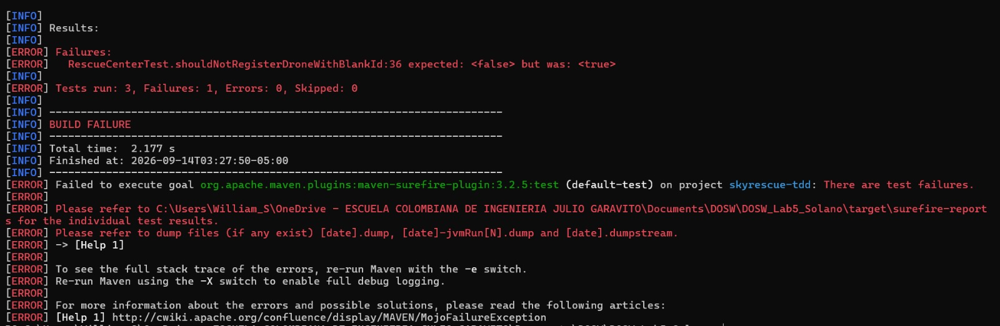
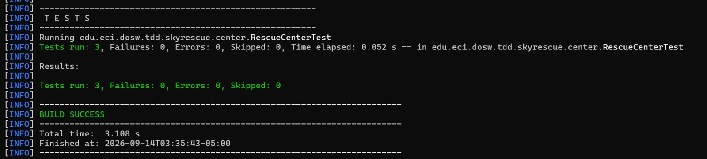
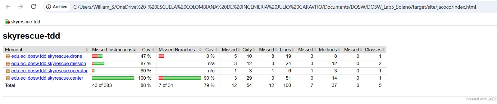
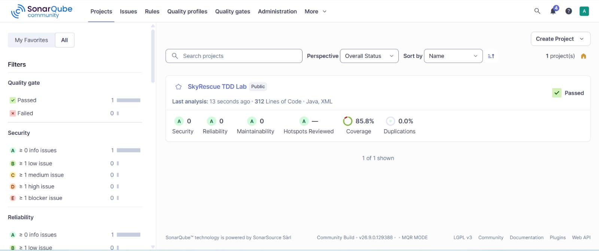

# LABORATORIO - TDD, CUBRIMIENTO Y ANÁLISIS ESTÁTICO

**Escuela Colombiana de Ingeniería Julio Garavito**
**Curso:** Desarrollo y Operaciones de Software - DOSW
**Caso de estudio:** SkyRescue - Coordinación de drones para emergencias

## Integrantes

| Nombre    | Correo institucional                          | Usuario de GitHub |
| --------- | --------------------------------------------- | ------------------ |
| Paula Andrea Solano Morales | paula.solano-m@mail.escuelaing.edu.co | AndreaSolano23 |

(este laboratorio se desarrolló de forma individual.)
## Descripción de SkyRescue

SkyRescue coordina drones que apoyan operaciones de emergencia en una ciudad, transportando kits médicos, cámaras térmicas o radios hacia zonas de difícil acceso. El sistema registra drones y operadores, asigna misiones a zonas de emergencia y cierra una misión cuando el dron regresa. Las reglas principales impiden asignar un dron ya ocupado, enviar un dron más allá de su autonomía, asignar misiones a operadores inexistentes, permitir que un operador controle dos misiones activas a la vez, y cerrar dos veces la misma misión. Las tres operaciones desarrolladas con TDD son `addDrone` (registro de drones), `assignMission` (asignación de misiones) y `completeMission` (cierre de misiones).

## Ciclo TDD - registro de dron

**RED:** prueba que demuestra que un dron con id vacío se registra igual (sin ser rechazado) antes de implementar la validación en `addDrone`.

**GREEN:** implementación mínima que valida el id vacío/nulo y hace pasar la prueba.

**REFACTOR:** se extrajo el método `isInvalid(Drone drone)` para agrupar las validaciones de `drone == null`, `drone.getId() == null` y `drone.getId().isBlank()`, eliminando la repetición de tres condiciones separadas dentro de `addDrone`.

## Cobertura

### Primera ejecución

### Cobertura final

Cobertura de líneas alcanzada: **88%** (mínimo requerido: 85%), verificada automáticamente por JaCoCo en la fase `verify`.

## SonarQube

- Quality Gate: **Passed**
- Cobertura reportada: 85.8%
- Security: A (0 issues) · Reliability: A (0 issues) · Maintainability: A (0 issues) · Duplications: 0.0%
- Se corrigieron los 3 issues detectados en el primer análisis: 2 relacionados con especificar explícitamente la zona horaria en `LocalDateTime.now()`, y 1 relacionado con una lambda de prueba con más de una invocación que podía lanzar excepción.

## Pull Requests

- PR JUnit + skeleton: #1
- PR clases base (skyrescue-classes): #2
- PR TDD addDrone: #3
- PR TDD assignMission: #4
- PR TDD completeMission: #5
- PR JaCoCo (merge correcto a develop): #8
- PR SonarQube: #9

## Reflexión técnica

**¿Qué error o comportamiento inesperado fue detectado primero gracias a una prueba?**

La prueba de registrar un dron con id vacío reveló que `addDrone` no validaba nada: cualquier dron, incluso con datos inválidos, se guardaba sin problema. La prueba de registrar dos drones con el mismo id mostró que un `Map` reemplaza silenciosamente el valor anterior sin avisar, lo cual hubiera pasado desapercibido sin la prueba.

**¿Qué parte del código cambió durante REFACTOR sin modificar el comportamiento?**

En `addDrone`, las tres validaciones (`null`, id nulo, id vacío) se unificaron en un solo método `isInvalid`, y la comprobación de duplicado se separó como una condición aparte. En `assignMission`, las cinco validaciones de negocio se extrajeron a un método `validateAssignment`, dejando el método principal enfocado solo en construir y guardar la misión.

**¿Qué casos adicionales aparecieron al revisar la cobertura?**

El reporte de JaCoCo mostró que las clases `Drone`, `Mission`, `MissionStatus` y `RescueOperator` tenían buena cobertura de líneas pero cobertura de ramas más baja en `Drone`, específicamente en el método `equals()` (comparación con `null`, con otro tipo, y con otro dron de distinto id), que solo se ejercitaba indirectamente a través de `RescueCenter`.

**¿Qué hallazgo de SonarQube produjo un cambio real en el código?**

SonarQube señaló que `LocalDateTime.now()` debía especificar explícitamente la zona horaria en vez de depender implícitamente de la del sistema, lo cual se corrigió usando `LocalDateTime.now(ZoneId.systemDefault())` en `assignMission` y `completeMission`. También señaló que una prueba con `assertThrows` no debía tener más de una invocación de método dentro de la lambda, lo cual llevó a extraer `mission.getId()` a una variable antes de la aserción.